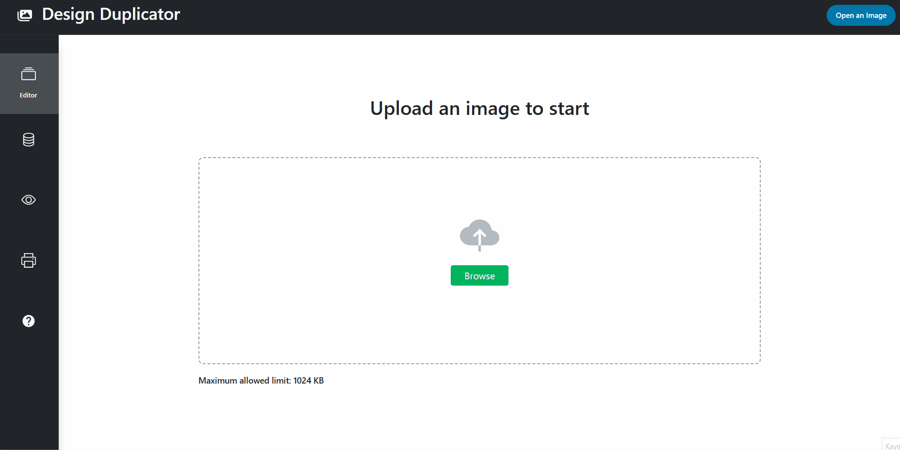
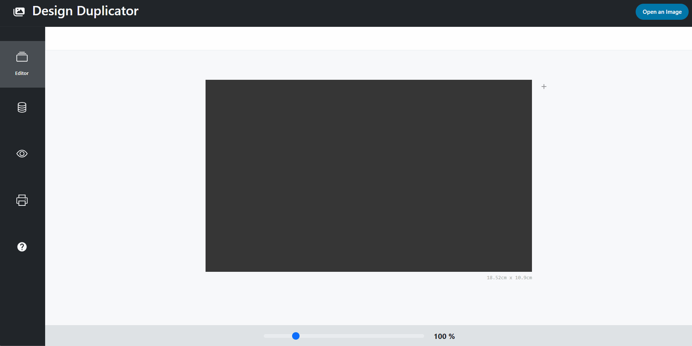
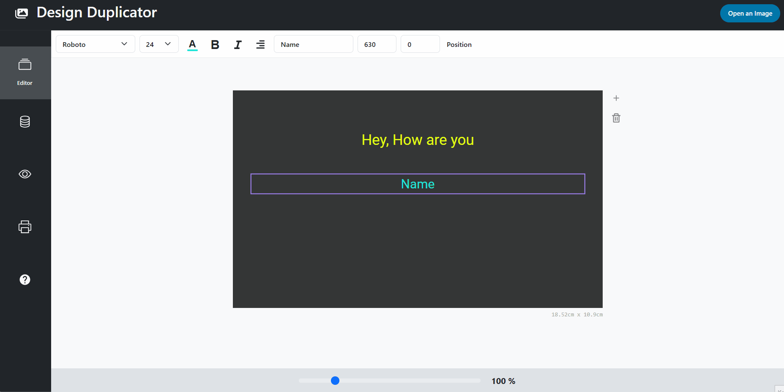
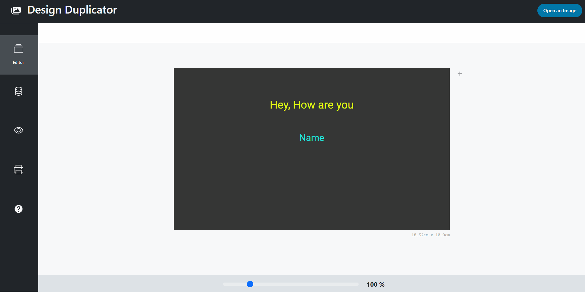

# DesignAutofiller

**DesignAutofiller** is a React application that automatically fills your design using data imported from various file formats, such as **.xlsx, .csv, .json**, or **.txt**.

## Features

- Easily upload an image to use as the base for your design.
- Add customizable text items to your design.
- Import data from various sources to automatically generate multiple versions of your design.
- Bind imported data columns to specific text items in your design.
- Adjust the print size and print your duplicated designs directly from the browser.

## How It Works

Follow these steps to use the application:

### Step 1: Upload an Image
Upload an image that you want to use for your design.  
*Note: The maximum allowed size is **1024 KB**.*

### Step 2: Add Text Items
Add text items to your design and customize their appearance as needed.

### Step 3: Import a Data Source
Import a data source in **.xlsx, .csv, .json,** or **.txt** format for duplication.  
*Note: The file should contain a header row.*

### Step 4: Bind Data to Text Items
Bind columns from your imported data source to the text items you've added to your design.

### Step 5: Adjust Print Settings
Select 'Print' from the menu on the left side, and adjust the size of the design that will be duplicated using the data source.

### Step 6: Print Your Design
After adjusting the size, click the 'Print' button. Your browser's print screen will open with the duplicated designs ready to be printed.

### Finally
Congratulations! Your design has been successfully duplicated using the imported data.

## Getting Started

To run the application locally, follow these steps:

1. **Clone the repository:**
   ```bash
   git clone https://github.com/muratsercann/DesignAutoFiller.git
2. **Install the dependencies:**
   ```bash
   cd DesignAutofiller
   npm install
3. **Start the application:**
   ```bash
   npm start

## Visual Guide

### Step 1 : Upload an image


### Step 2 : Add text items and customize them


### Step 3 : Add your data source as xlsx, csv, json or txt file and bind columns with text items that you added


### Step 4 : Adjust size and print dublicated designs

